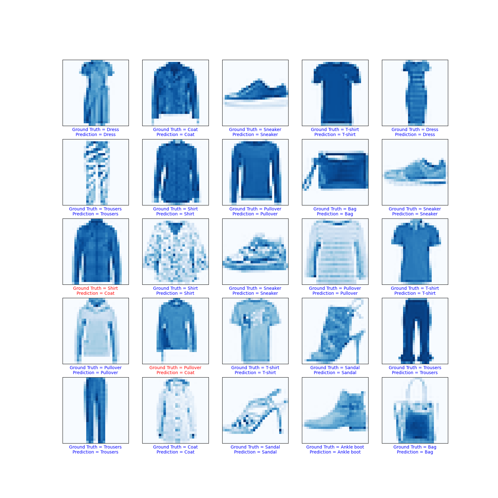
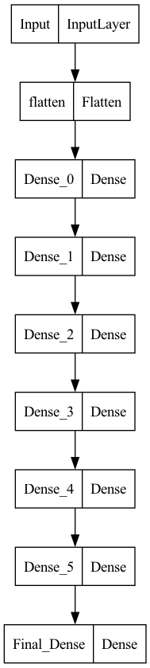

# Classification-Model-fashion-mnist
### An implementation of classification model using deep learning for Fashion dataset of mnist.

In this simple project, a deep learning based classification model is constructed, which tries to predict the name of fashion data from the given 28x28 size image.

The dataset used here is the Fashion mnist database. It is similar to mnist's handwritten database. It is from Zalando's article images. Zalando seeks to replace the original mnist's database as a de-facto training dataset for a ML model.

Though being equivalent to mnist's original database in most aspects, it is a bit harder for models to correctly predict, since some fashion elements are more similar to each other.

It consists of 10 labels.

| Number | 0 | 1 | 2 | 3 | 4 | 5 | 6 | 7 | 8 | 9|
|-|-|-|-|-|-|-|-|-|-|-|
| Label | T-shirt | Trousers| Pullover | Dress | Coat | Sandal | Shirt | Sneaker | Bag | Ankle boot |

    Blue = Correct Prediction
    Red  = Wrong prediction

The structure of the model is as below:

<!-- | No. | Label      |
|-----|------------|
| 0   | T-shirt    |
| 1   | Trousers   |
| 2   | Pullover   |
| 3   | Dress      |
| 4   | Coat       |
| 5   | Sandal     |
| 6   | Shirt      |
| 7   | Sneaker    |
| 8   | Bag        |
| 9   | Ankle boot | -->